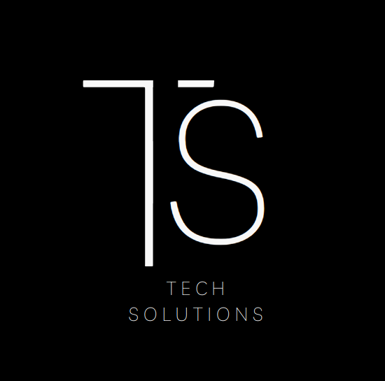

# Nome da Empresa: Tech Solutions

## Uma breve Introdução:

Bem-vindo à Tech Solutions, uma empresa dedicada a fornecer
soluções inovadoras e tecnológicas para empresas de todos os tamanhos.
Nosso foco principal é ajudar nossos clientes a alcançar seus
objetivos de negócios por meio de tecnologia de ponta e serviços de
consultoria especializados. Com uma equipe talentosa e apaixonada,
estamos comprometidos em impulsionar a transformação digital e
promover a excelência em todas as áreas.

## Sobre a empresa:

Tech Solutions foi fundada em 2015 por um grupo de
visionários apaixonados por tecnologia, determinados a fazer a
diferença no mundo dos negócios. Desde então, crescemos
exponencialmente, expandindo nossos serviços e estabelecendo uma
reputação de excelência e inovação. Nossa equipe é composta por
especialistas em diversas áreas, incluindo desenvolvimento de
software, análise de dados, inteligência artificial, cibersegurança e
muito mais. Acreditamos em parcerias colaborativas com nossos
clientes, trabalhando lado a lado para encontrar soluções
personalizadas que atendam às suas necessidades específicas e
impulsionem seu sucesso.

## Clientes:

1. **XPTO GlobalTech Corp:** Uma empresa multinacional líder no setor de
tecnologia, que confia na Tech Solutions para desenvolver e
implementar soluções de software personalizadas para otimizar seus
processos internos e melhorar a eficiência operacional.

2. **XPTO HealthCare Innovations Ltda:** Uma empresa de assistência médica
que utiliza os serviços da Tech Solutions para desenvolver e
manter sua plataforma de telemedicina, garantindo atendimento de
qualidade aos pacientes e facilitando a comunicação entre médicos e
clientes.

3. **XPTO EcoGreen Solutions:** Uma startup dedicada a fornecer soluções
sustentáveis para empresas. Eles colaboram com a Tech Solutions 
para desenvolver um aplicativo móvel que ajuda os usuários a
encontrar e adotar práticas sustentáveis em suas vidas diárias.

Este é apenas um vislumbre do que fazemos na Tech Solutions.
Estamos sempre abertos a novas parcerias e oportunidades de
colaboração. Entre em contato conosco para saber mais sobre como
podemos ajudar sua empresa a prosperar na era digital.